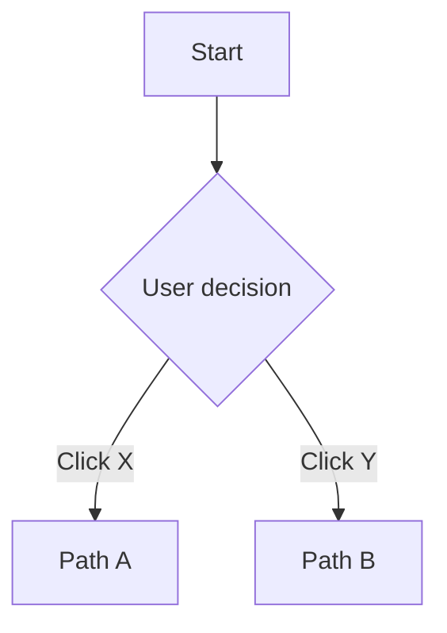

# Muse: A Manifesto for Joyful Creation

## The Joy Has Been Lost from The Creative Process

---

## 🌿 "Muse Flow (music)" – 5 Movements from Jobs-to-be-Done to Working Code

### Process Stages Overview

Muse flows through seven **iterative stages**, grouped into three main **phases**. **Design and Development operate in parallel**, with each stage continuously informing the others.

| Phase | Stage | Name | Purpose |
|-------|-------|------|---------|
| **Prep** | 1 | Communication, Tracking & Data Discovery | Establish async workflows and investigate real data conditions. |
| **Design ↔ Develop** | 2 | Ideation & Lo-Fi Exploration | Rapid, low-cost idea exploration. Sketches (even Markdown-powered) live here. |
| | 3 | Self-Validating Specifications | BDD feature specs that define user journeys and auto-generate test scaffolding. |
| | 4 | Direct Development with Real Data | Build components in-context with real data and edge cases from day one. |
| | 5 | Core Tech Stack & Feedback | Shared monorepo tools, data layer, runtime, and real-time stakeholder feedback. |
| **Launch & Learn** | 6 | Release Cadence | Lightweight, continuous flow of deployment and prioritization. |
| | 7 | Monitoring, Observability & Impact | Data-driven feedback loop to validate feature success and improve future iterations. |

Each stage is iterative — teams are encouraged to revisit, refine, and loop back as new insights emerge.

---

## 🧠 Key Philosophy Shifts

- **Human-Centered Design First:** Start with full user journeys, not isolated tasks.
- **Physics of Flow:** Work flows "just in time" with no handoff friction.
- **Context-Native Components:** Built directly in their live data environments.
- **Evolutionary BDD:** Self-validating specs that evolve with usage patterns.
- **Real Data Over Mock Data:** Edge cases are discovered during development.
- **Dual Track Async Design/Dev:** Design informs dev at natural points—not forced checkpoints.
- **Process-as-a-Product:** The methodology itself is subject to feedback and evolution.
- **Event-Driven Documentation:** ADRs captured when decisions happen, not scheduled meetings.
- **AI-Aided Design Sprints:** Compressed into hours not weeks, aided by human-curated AI.
- **Minimal Viable Documentation:** Document where it provides the most value.
- **User-Controlled UI:** Respect system preferences (e.g., dark mode, prefers) and avoid anti-features like theme toggles.
- **Async-Meeting Culture:** Replace time-wasting meetings with purposeful, async communication and focused collaboration.
- **Lean Operations, Rich Creation:** We aggressively favor free-tier and open-source tools. Money should be spent on what directly creates user value, not on operational overhead. This keeps the team lean, agile, and focused on the joy of building, not on burn rates.

---

## 🗣️ Stakeholder Rhythm (Async-Meeting Culture)

### Unified Leadership, Natural Flow

Muse operates on a **hybrid approach** between visionary leadership and tactical execution:

- **Yearly Vision:** Higher-level management provides annual direction and documents strategic goals
- **Evolutionary Execution:** Teams adapt and refine implementation based on real-world feedback
- **Management by Exception:** C-level involvement only when direction needs clarification or major obstacles arise

### Communication Cadence

**Daily: Async Standups**
- Written updates via Slack/Discord/GitHub w automated prompts for missing updates
- No synchronous meetings required
- Focus on progress, blockers, and next steps
- AI bot assists with note-taking and ticket creation

**Weekly: Encouragement & Alignment**
- 30-minute team check-in focused on morale and high-level direction
- Not a status meeting—more like "how are we feeling about this work?"
- Rotate leadership to prevent meeting fatigue

**Bi-weekly: Stakeholder Previews**
- Share Vercel preview links with light commentary
- Stakeholders provide feedback asynchronously
- Focus on "is this the right direction?" rather than pixel-perfect feedback

**Monthly: Strategic Alignment**
- Leadership reviews overall direction and priorities
- Adjust course based on Stage 7 monitoring data
- Plan resource allocation and team needs

### Blocker Resolution Protocol

- **Real-time via Chat:** Blockers are resolved immediately between the blocked person and the blocker
- **AI Assistant:** Bot monitors conversations and suggests creating tickets or escalating to team
- **No Meeting Required:** Most blockers can be resolved through quick chat or screen share

---

## 🕰️ The Sustainable Work Rhythm Stimulates Play

### The 4.5-Day Week Structure

**Week A (Full Week):**
- Monday: 9 hours (deep work day)
- Tuesday: 9 hours (collaboration day)
- Wednesday: 9 hours (development day)
- Thursday: 9 hours (review/feedback day)
- Friday: 9 hours (planning/cleanup)

**Week B (Long Weekend):**
- Monday: 9 hours (deep work day)
- Tuesday: 9 hours (collaboration day)
- Wednesday: 9 hours (development day)
- Thursday: 9 hours (review/feedback day)
- Friday: OFF

**Total:** 40.5 hours per week average across the year (50 work weeks)

### Day-Type Definitions (to be validated)

- **Deep Work:** Individual coding, design, or spec writing with minimal interruptions
- **Collaboration:** Pair programming, design reviews, planning discussions
- **Development:** Implementation, testing, and integration work
- **Review/Feedback:** Code review, stakeholder feedback, BDD spec validation
- **Planning/Cleanup:** Retrospectives, technical debt, process improvement

### Benefits

- **3-day weekends every other week** for creative rest and personal time
- **Predictable rhythm** that teams can plan around
- **Focused work blocks** that reduce context switching
- **Built-in rest** that research shows is essential for creative work

---

## 🤖 AI Communication Assistant

### Intelligent Chat Integration

An AI bot monitors team communications and provides intelligent assistance:

**Proactive Suggestions:**
- "Should I create a ticket for that feature request?"
- "This sounds like it might affect the user onboarding spec—want me to flag it?"
- "I noticed this technical discussion might warrant an ADR"

**Automatic Note-Taking:**
- Summarizes ad-hoc technical discussions
- Extracts action items and decisions
- Links conversations to relevant GitHub issues or specs

**Context Awareness:**
- Understands current sprint goals and feature development
- Recognizes when conversations drift from implementation to design
- Suggests moving detailed technical discussions to appropriate channels

### Implementation Approach

- **Start Simple:** Basic Slack/Discord integration with keyword recognition
- **Evolve Gradually:** Add more sophisticated context awareness over time
- **Privacy First:** Team controls what the AI can access and suggest
- **Human Override:** All AI suggestions require human approval before action

---

## 🏗️ Technical Debt Management Strategy

### Future-Friendly Architecture

Rather than fighting technical debt, Muse embraces technological evolution:

**Lightweight but Powerful:**
- Choose libraries with excellent documentation and strong communities
- Prioritize simplicity over premature optimization
- Focus on standards-based solutions that age well

**AI-Assisted Migration:**
- Document architectural decisions to support future AI-powered refactoring
- Maintain clear component boundaries for easier replacement
- Use TypeScript and structured schemas to support automated code generation

**Incremental Replacement:**
- New features use current best practices
- Legacy code is migrated opportunistically when touched
- Avoid big-bang rewrites in favor of gradual modernization

### Specification Evolution Framework

**Spec Confidence Levels:**

| Confidence Level | Description | Testing Strategy |
|------------------|-------------|------------------|
| **High Confidence** | Well-understood patterns with clear user research backing | Comprehensive test coverage required |
| **Medium Confidence** | Reasonable assumptions based on similar features | Standard test coverage |
| **Low Confidence** | Experimental features requiring heavy monitoring and iteration | Lightweight test coverage initially |

**Evolution Triggers:**
- Stage 7 monitoring reveals different usage patterns than expected
- Real user feedback contradicts original assumptions
- Technical constraints emerge during development

---

## 🌱 PREP PHASE

### Stage 1: Communication, Tracking & Data Discovery

Establish a unified system of record for ideas, specs, code, and decisions using GitHub Discussions, Issues, Projects, and Pull Requests. This creates full traceability from ideation to release and supports asynchronous, remote-first collaboration.

In parallel, conduct a **pre-development data audit** to ensure the system starts with a shared understanding of current data reality:

- **Data Inventory & Profiling:** Use tools like `prisma db pull`, AI-assisted schema generators, or exploratory queries to profile existing structures.
- **Quality Baseline:** Define what "clean enough" looks like per key user journeys.
- **Reality Contracts:** Treat the current database schema as a living contract. Evolve it over time rather than attempting perfection upfront.
- **Event-Driven ADRs:** Architectural decisions are captured when they happen, using AI to assist with formatting and clarity.

#### Data Reality Check Template

```markdown
## Data Reality Assessment

- [ ] Schema documentation exists and is current
- [ ] Edge cases identified (nulls, empty arrays, malformed data)
- [ ] Performance baselines established
- [ ] Data privacy/security constraints documented
- [ ] Migration path planned for schema evolution
- [ ] Real user data patterns analyzed
- [ ] API contracts defined and versioned
```

Example Prisma Schema:

```prisma
model User {
  id    String @id @default(cuid())
  email String @unique
  name  String?
  posts Post[]
}

model Post {
  id       String @id @default(cuid())
  title    String
  content  String?
  authorId String
  author   User   @relation(fields: [authorId], references: [id])
}
```

*NOTE: These processes will be text-based with the goal of increasing automation over time as patterns solidify.*

---

## 🎨 DESIGN ↔ 🔧 DEVELOP PHASE (PARALLEL)

### Stage 2: Ideation & Lo-Fi Exploration

Artifacts at this stage are intentionally low-fidelity and disposable to avoid locking into the wrong design. Paper is cheap but time is money.

Includes sketches, whiteboards, or markdown-based wireframes. The goal is to find the right problem and approach before committing to code. Integrated into GitHub Discussions for visibility.

- **Design Status Tags:** Use `Do`, `Doing`, and `Done` statuses to manage design iteration.
- **Design Definition of Done:** A sketch or flow is considered "done" when:
  - It solves a validated user problem
  - It aligns with known constraints (data, tech, UX)
  - It is peer-reviewed and accepted into the discussion board
  - It is clearly documented in markdown, Figma, or embedded artifact
  - It's ready to promote to spec (Stage 3)

- **Markdown-Powered Sketching:** Use [Mermaid](https://mermaid-js.github.io/) or [Markmap](https://markmap.js.org/) to create diagrams directly in Discussions or markdown files:



- **Cross-Stage Visibility:** When validated, sketches can be preserved in `design-archive/` folders or linked to specs.
- **AI-Aided Variation:** Prompt AI to generate alternative flows for comparison:
  > "Generate three design variations for onboarding that reduce drop-off at step two."
- **Iterative by Design:** Expect to return to this stage as specs or components raise new insights.

### Stage 3: Self-Validating Specifications

*Bridge between design and development, where user intent becomes executable truth.*

Stage 3 formalizes validated design ideas into executable, living specifications. These take the form of human-readable `.feature` files using **Behavior-Driven Development (BDD)**, which define complete user journeys in plain language. These specs double as documentation and automated tests, ensuring every feature delivers clear value and is always tested against real expectations.

#### 📄 The Spec Format

Specs are written in [Gherkin](https://cucumber.io/docs/gherkin/) syntax:

```gherkin
Feature: User onboarding flow

Scenario: New user completes signup
  Given a visitor is on the homepage
  When they click "Get Started"
  And they fill out the registration form
  Then they should see a welcome screen
```

- **Feature:** The high-level user value
- **Scenario:** A single outcome or journey path
- **Given/When/Then:** The sequence of user behavior and expected results

#### ✅ What Makes a Spec "Done"?

A self-validating spec is considered ready when:

- The problem is validated via Design (Stage 2)
- The journey is expressed in plain language and testable steps
- It includes real-world edge cases (e.g. bad input, missing data)
- It includes confidence level assessment (High/Medium/Low)
- It is peer-reviewed and merged into the `specs/` folder
- It runs as a Playwright or Cucumber test
- It passes with current data or raises intentional failures for edge cases

#### 🎯 Spec Confidence Levels

| Confidence Level | Characteristics | Testing Strategy |
|------------------|-----------------|------------------|
| **High Confidence** | Based on validated user research or established patterns | BDD + visual smoke test |
| **Medium Confidence** | Reasonable assumptions based on similar features | BDD + device matrix + a11y checks |
| **Low Confidence** | Experimental features or new problem domains | BDD + session replay + user testing + analytics tracking |

#### 🧐 UX-Risk-Based Testing Strategy

Not all features need the same rigor. Testing intensity scales with the user experience impact and novelty:

| UX Risk | Example Features | Testing Strategy |
|---------|------------------|------------------|
| **Low** | Standard login, pagination | BDD + visual smoke test |
| **Medium** | Onboarding wizard, payment flow | BDD + device matrix + a11y checks |
| **High** | Complex dashboards, dynamic UIs | BDD + session replay + user testing + analytics tracking |

This approach saves effort on boilerplate while focusing deeply on what's risky or novel.

#### 🛠️ Tools & Integration

- **Playwright + Cucumber:** Automates `.feature` specs as browser-based end-to-end tests
- **Test Runs in CI:** Every commit runs all passing `.feature` files using real or seeded data
- **PR Hooks:** Specs required for any new feature before merge
- **Fallback Tests (Optional):** Manual or snapshot tests for visual diffing, etc.

#### ♻️ Evolutionary Feedback Loop

- Failed tests signal **spec drift**—revisit design or refine the expectation
- Usage analytics (Stage 7) inform spec updates
- AI can suggest edits or identify untested paths

Example AI prompt:
> "Suggest missing scenarios in the user onboarding flow based on top user session patterns."

*NOTE: These specs and tests are not static. They are refined over time as user data and real usage provide new insight.*

---

### Stage 4: Direct Development with Real Data

Stage 4 is where code meets reality. Instead of developing components in isolation with mock data, we build them **directly in the Next.js application context**, using real schemas and live or seeded data. This ensures every feature is grounded in truth, resilient to edge cases, and continuously informed by how users actually interact.

#### 🧬 Context-Native Development

- Components are built **inside their intended context**, not abstracted sandboxes.
- Instead of "design to dev handoff," the developer works from the spec and real user data simultaneously.
- Edge cases are surfaced automatically, not weeks later during QA.
- Flow between spec (Stage 3) → component → feedback (Stage 5) is seamless.

#### 📚 Design System in Code

Instead of a separate design token file or Figma library, the system evolves in the codebase with a three-tier component architecture:

- **Design Tokens via Tailwind**: Define consistent colors, spacing, etc.
- **Linting for Consistency**: Enforce rules like spacing, typography, or a11y
- **Docs generated from spec and displayed in Component Book (kitchen sink)**: Each component documented in context

```css
// globals.css
@theme {
  --font-display: "Satoshi", "sans-serif";
  --breakpoint-3xl: 120rem;
  --color-avocado-100: oklch(0.99 0 0);
  --color-avocado-200: oklch(0.98 0.04 113.22);
  --color-avocado-300: oklch(0.94 0.11 115.03);
  --ease-fluid: cubic-bezier(0.3, 0, 0, 1);
  --ease-snappy: cubic-bezier(0.2, 0, 0, 1);
  /* ... */
}
```

##### Component Architecture

**🔹 1. Atoms → /components/ui**

💡 **Purpose:** Reusable building blocks. Pure presentation.
📦 **Contents:** Buttons, Inputs, Icons, Avatars, etc.

- No business/domain knowledge
- No layout assumptions
- Just props in → UI out
- Fully covered by the design system

```typescript
// Button.tsx
import * as Headless from '@headlessui/react'
import clsx from 'clsx'
import React, { forwardRef } from 'react'
import { Link } from './link'

const styles = {
  base: [
    'relative isolate inline-flex items-baseline justify-center gap-x-2 rounded-lg border text-base/6 font-semibold',
    'px-[calc(--spacing(3.5)-1px)] py-[calc(--spacing(2.5)-1px)] sm:px-[calc(--spacing(3)-1px)] sm:py-[calc(--spacing(1.5)-1px)] sm:text-sm/6',
    'focus:not-data-focus:outline-hidden data-focus:outline-2 data-focus:outline-offset-2 data-focus:outline-blue-500',
    'data-disabled:opacity-50',
    '*:data-[slot=icon]:-mx-0.5 *:data-[slot=icon]:my-0.5 *:data-[slot=icon]:size-5 *:data-[slot=icon]:shrink-0',
  ],
  solid: [
    'border-transparent bg-(--btn-border)',
    'dark:bg-(--btn-bg)',
    'before:absolute before:inset-0 before:-z-10 before:rounded-[calc(var(--radius-lg)-1px)] before:bg-(--btn-bg)',
    'before:shadow-sm',
  ],
  red: [
    'text-white [--btn-hover-overlay:var(--color-white)]/10 [--btn-bg:var(--color-red-600)] [--btn-border:var(--color-red-700)]/90',
    '[--btn-icon:var(--color-red-300)] data-active:[--btn-icon:var(--color-red-200)] data-hover:[--btn-icon:var(--color-red-200)]',
  ],
}

export const Button = forwardRef(function Button({ color, outline, plain, className, children, ...props }, ref) {
  let classes = clsx(
    className,
    styles.base,
    outline ? styles.outline : plain ? styles.plain : clsx(styles.solid, styles.colors[color ?? 'dark/zinc'])
  )

  return 'href' in props ? (
    <Link {...props} className={classes} ref={ref}>
      <TouchTarget>{children}</TouchTarget>
    </Link>
  ) : (
    <Headless.Button {...props} className={clsx(classes, 'cursor-default')} ref={ref}>
      <TouchTarget>{children}</TouchTarget>
    </Headless.Button>
  )
})

export function TouchTarget({ children }) {
  return (
    <>
      <span className="absolute top-1/2 left-1/2 size-[max(100%,2.75rem)] -translate-x-1/2 -translate-y-1/2 pointer-fine:hidden" aria-hidden="true" />
      {children}
    </>
  )
}
```

**🔸 2. Features → /components/features**

💡 **Purpose:** Domain-aware components that implement flows or page-specific functionality
📦 **Contents:** SignupForm, ProductList, UserProfileCard, CommentThread

- Composes multiple atoms
- Can contain logic (e.g., fetch, validation)
- Bound to business domain or app feature
- Mapped directly to .feature files

```typescript
// SignupForm.tsx
import { Input, Button } from "@/components/ui";

export function SignupForm() {
  const { register, handleSubmit } = useForm();
  return (
    <form onSubmit={handleSubmit(...)} className="space-y-4">
      <Input {...register("email")} />
      <Input {...register("password")} type="password" />
      <Button type="submit">Sign Up</Button>
    </form>
  );
}
```

**🟦 3. Layouts → /app/layout.tsx (or /layouts)**

💡 **Purpose:** Structural container for pages
📦 **Contents:** Header, Footer, Sidebar, Page shell using CSS Grid

- Defines grid-template-areas and placement
- Rarely needs logic (though can conditionally show/hide sections)
- Controls flow/responsiveness — e.g. how aside, main, footer shift on small screens

```typescript
// layout.tsx
export default function Layout({ children }) {
  return (
    <html lang="en">
      <head>
        <style>
          {`
            @media all {
              body {
                display: grid;
                grid-template-columns: 1fr;
                grid-template-areas:
                  "header"
                  "main"
                  "footer";
                max-width: 1024px;
                margin: 0 auto;
                min-height: 100vh;
              }
            }
            @media (min-width: 640px) {
              body {
                grid-template-columns: 200px 1fr;
                grid-template-rows: auto 1fr auto;
                grid-template-areas:
                  "aside header"
                  "aside main"
                  "aside footer";
              }
            }
          `}
        </style>
      </head>
      <body className="text-sm leading-relaxed">
        <aside className="[grid-area:aside] bg-gray-100 p-4">Aside</aside>
        <header className="[grid-area:header] bg-blue-500 text-white p-4">Header</header>
        <main className="[grid-area:main] p-4">{children}</main>
        <footer className="[grid-area:footer] bg-gray-200 p-4">Footer</footer>
      </body>
    </html>
  );
}
```

#### ✅ "Done" Definition for Components

A component is considered complete when:

- It fulfills a corresponding `.feature` scenario
- It handles both typical and messy real-world data
- It uses tokens, styles, and patterns from the shared system
- It is covered by an automated test or manual test case
- It's reviewed in a PR with a Vercel preview or similar
- It gracefully degrades if data is missing or invalid

#### 🔁 Bidirectional Flow

- **Upstream to Design:** Building reveals missing states or complexity → Design (Stage 2) revisits flows.
- **Downstream to Feedback:** Working code is immediately deployed for review in Stage 5.

```typescript
// UserCard.tsx
export function UserCard({ user }: { user: User }) {
  return (
    <div className="p-4 border rounded">
      <h2>{user.name ?? "Unnamed User"}</h2>
      <p>{user.email}</p>
    </div>
  );
}

// Sample data injection in page
const user = await prisma.user.findFirst({ where: { email: "demo@example.com" } });
return <UserCard user={user} />;
```

---

### Stage 5: Core Tech Stack & Real-Time Feedback

This stage provides the foundational technology, infrastructure, and feedback mechanisms that power fast, reliable development and ensure stakeholder visibility into progress and quality.

#### Tech Stack Highlights

- **Monorepo with Turborepo:** Enables sharing components, BDD specs, utilities, and data contracts between clean and legacy projects. Supports incremental builds and remote caching optimized for Vercel deployments.
- **Data Layer - Prisma:** Type-safe ORM that connects your database schema to your application code. It acts as the single source of truth for data models, providing a seamless bridge between the database and frontend.
- **Database - Vercel Postgres:** Fully managed, scalable PostgreSQL database optimized for Vercel. Supports instant deployments and scales transparently.
- **Framework - Next.js (App Router):** Industry-standard React framework offering server-side rendering, incremental static regeneration, and edge functions for performance and scalability.
- **Language - TypeScript:** Strongly typed superset of JavaScript ensuring type safety and improved developer experience.
- **Styling - Tailwind CSS:** Utility-first CSS framework for rapid UI development with enforced design system consistency.
- **Security & Quality:** Integrated Dependabot, CodeQL static analysis, and other tools catch vulnerabilities early.

#### Feedback & Workflow Integration

- **Vercel Preview Deployments:** Every branch gets an instant, shareable preview environment. Stakeholders can interact with real functionality and provide early feedback.
- **Pull Request Comments:** Integrated with previews, allowing contextual discussion on changes.
- **Automated CI Tests:** Playwright & Cucumber specs run on every push, validating that features match specs in real data environments.
- **Shared Component Library:** Encourages reuse and design consistency. Changes propagate through the monorepo with version control.
- **Real-Time Monitoring Hooks:** Enables feature flag toggling and quick rollback if needed.

#### Process Health Monitoring

**Retrospective Triggers:**
- When features take >2 weeks to get user feedback
- When >30% of BDD specs fail in production
- When component rework exceeds new development time
- When stakeholder feedback conflicts with established specs

**Quality Gates:**
- All new features must have corresponding BDD specs
- All components must handle null/undefined data gracefully
- All API changes must be backwards compatible or properly versioned
- All PRs must include preview deployment links

#### Development Tooling Example: Component Inspector

As an example of how Stage 5 tooling supports Muse methodology, we can look at the Component Inspector - a development tool that allows developers to browse and inspect components directly in their development environment.

```gherkin
Feature: Component Inspector
  As a developer working on the application
  I want to inspect and browse components directly in the dev environment
  So that I can quickly reference documentation and variants without leaving my development context

Background:
  Given I am in development mode
  And the application is running locally

Scenario: Opening component inspector with floating button
  Given I am viewing any page in the application
  When I look at the bottom-right corner of the screen
  Then I should see a floating blue button with a layers icon
  When I click the floating button
  Then the component inspector panel should open from the right side
  And I should see a list of all available components

Scenario: Responsive behavior
  Given the component inspector is open
  And I resize the browser window
  Then the inspector panel should maintain its fixed width
  And the floating button should remain in the bottom-right corner
  And the panel should remain accessible and usable

Scenario: Component data loading
  Given the component inspector is first opened
  When the component discovery system is loading
  Then I should see a loading state or skeleton
  And once loaded, I should see all discovered components
  And components should be sorted alphabetically by name

Scenario: Error handling for missing components
  Given the component inspector is open
  And there are no components discovered
  When I look at the component list
  Then I should see an appropriate empty state message
  And I should see guidance on how to add component documentation

Scenario: Code syntax highlighting
  Given I am viewing a component's variant code
  When I look at the code preview
  Then JSX syntax should be highlighted appropriately
  And the code should be formatted in a monospace font
  And it should have a dark theme with green text on dark background
```

This Component Inspector exemplifies how Stage 5 tooling supports the entire Muse process by providing instant access to component documentation, variants, and related specs without leaving the development context.

#### Iteration & Improvement

- This stage continuously evolves alongside the other stages, with tech stack upgrades, testing enhancements, and feedback mechanisms refined over time.
- Stakeholder feedback loops ensure alignment and reduce costly rework downstream.

---

### Stage 6: Release Cadence

The Release Cadence stage operationalizes delivery. Instead of heavyweight release trains, Muse emphasizes small, safe, and frequent releases driven by feature readiness—not calendar dates. This enables faster feedback, reduces risk, and allows teams to stay focused on user value.

#### 🚀 Continuous Delivery, Not Continuous Chaos

- **CI/CD Pipelines:** Every merge deploys to staging; production behind feature flags.
- **Release by Feature, Not Sprint:** A feature is released when it's validated—not when the calendar says so.
- **Feature Toggles:** Use tools like ConfigCat, Flagsmith, or custom environment toggles to control exposure.
- **Progressive Rollouts:** Gradually enable features for internal users → beta group → everyone.

#### 🛎 Prioritization Flow

- **Triage Board:** GitHub Projects or similar reflects current work and readiness.
- **Decision-Making Criteria:** Value, risk, user demand, complexity, spec confidence level.
- **Stakeholder Involvement:** Releases shared as preview links with light commentary for business review.

#### Risk Management During Releases

- **Rollback Strategy:** Every release includes automated rollback triggers
- **Canary Deployments:** High-risk features get gradual exposure
- **Real-User Monitoring:** Stage 7 metrics inform immediate post-release decisions
- **Communication Plan:** Clear escalation path for issues discovered in production

#### 🧰 Tools

- **Vercel / Netlify / Railway:** Instant deploy previews and simple rollback.
- **ConfigCat / Flagsmith / LaunchDarkly:** Feature flagging platforms.
- **Github Projects / Linear:** Workflow and prioritization boards.

#### 🔁 Feedback to Prior Stages

- Real feedback from feature use helps improve specs (Stage 3) and designs (Stage 2).
- Rollout metrics inform future architecture and observability needs (Stage 5–7).
- Minor UX issues surfaced here are triaged back into Stage 1 discussions.

#### ✅ "Done" Means Shipped & Stable

A feature is considered complete at this stage when:

- It's deployed to production with appropriate flags or rollouts
- It's observed in the wild via metrics or behavior
- It meets the original spec criteria and generates no critical errors
- It's documented in changelogs or release notes
- It's safe to move on without debt or ambiguity

---

### Stage 7: Monitoring, Observability & Impact

This final stage ensures that deployed features deliver the intended value and feed actionable insights back into the cycle. By monitoring real-world usage and surfacing impact metrics, teams can validate assumptions, detect regressions, and refine priorities.

#### 📊 Feature Impact Monitoring

- **Core Metric Tracking:** Tie each feature to one or more measurable outcomes: usage rate, conversion, retention, satisfaction, etc.
- **Spec Confidence Validation:** Track how High/Medium/Low confidence specs perform in reality
- **Observability Hooks:** Implement structured logging and analytics events at key user touchpoints.
- **Session Replay (Optional):** Use tools like Highlight or LogRocket to view edge cases visually.

#### 🧪 Outcome Validation

- **Compare Actual vs Intended:** Each feature's success is measured against its original BDD spec intent.
- **Confidence Level Assessment:** Validate whether High/Medium/Low confidence assignments were accurate
- **Alert on Drift:** Sudden changes in behavior, performance, or engagement trigger follow-up reviews.
- **Experimentation:** A/B test feature variants to optimize outcomes.

#### Learning Integration

- **Spec Evolution:** Usage patterns inform updates to `.feature` files
- **Design Pattern Library:** Successful patterns are documented for reuse
- **Anti-Pattern Documentation:** Failed approaches are recorded to prevent repetition
- **Process Refinement:** Methodology itself is adjusted based on what works

#### 📈 Tools

- **PostHog / Plausible / Amplitude:** Event-based user behavior analytics.
- **Highlight / Sentry / LogRocket:** Frontend session recording and error tracking.
- **Grafana / Prometheus:** System-level performance and uptime